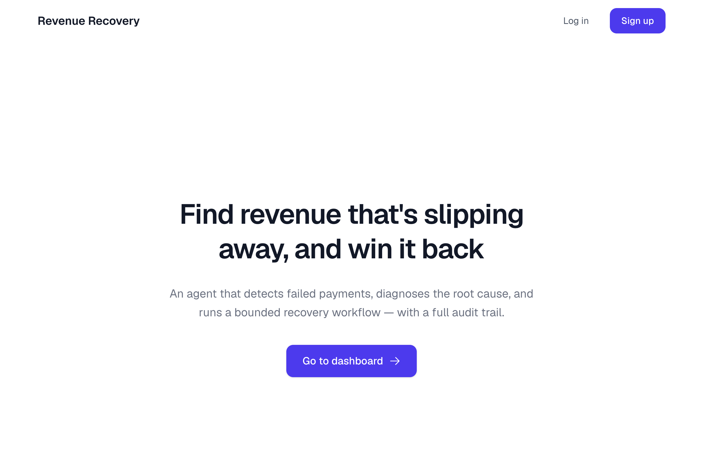
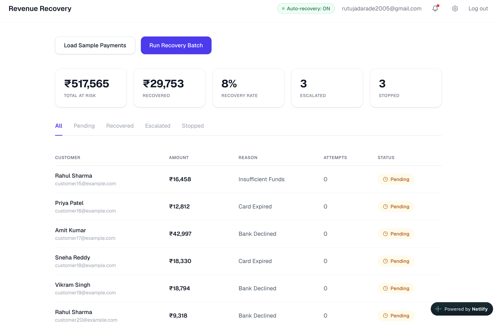

# AI Revenue Recovery

AI-powered revenue recovery platform that detects at-risk revenue, identifies failed payments, analyzes root causes, and recommends actionable recovery strategies.

## Overview

Revenue Recovery helps businesses find revenue that is slipping away and recover it through an AI-driven workflow.

The platform analyzes payment and customer signals to identify recovery opportunities and provides recommendations with a clear audit trail.

## Features

- Detect failed and at-risk payments
- Identify revenue leakage and recovery opportunities
- AI-powered root-cause analysis
- Intelligent recovery recommendations
- Revenue recovery dashboard
- Bounded recovery workflow
- Audit trail for recovery actions

## Screenshots

### Landing Page



### Dashboard



## Tech Stack

- Next.js
- TypeScript
- Supabase
- AI / LLM
- Tailwind CSS

## Getting Started

```bash
git clone https://github.com/rutuja2005byte/ai_revenue_recovery.git
cd ai_revenue_recovery
npm install
npm run dev